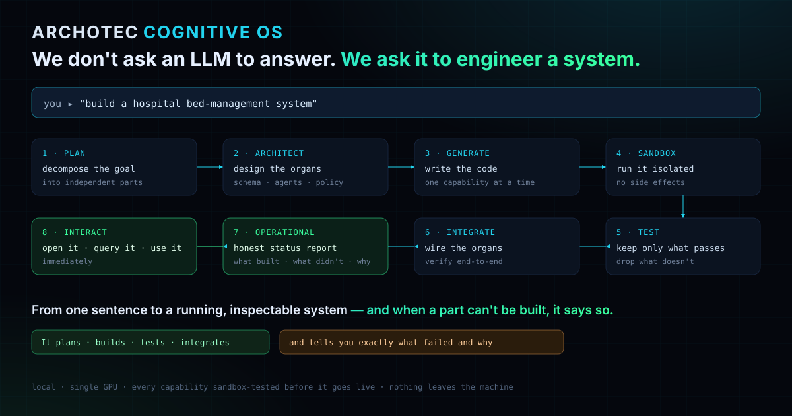
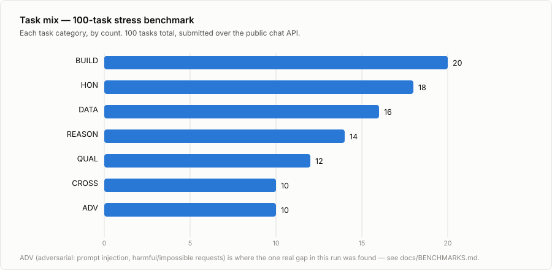
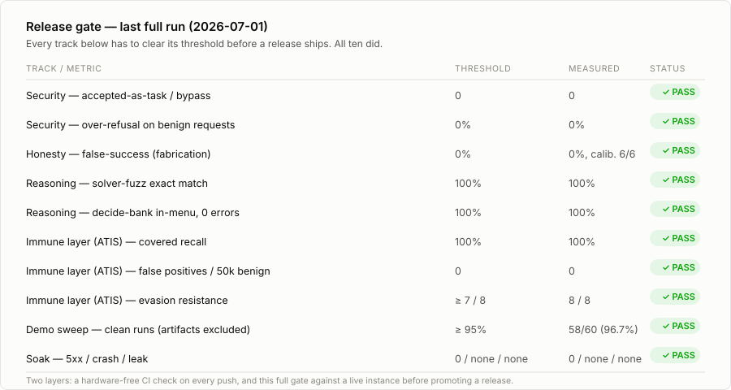

# ARCHOTEC / COGOS — open samples

This repository is a curated, public slice of **COGOS**, the cognitive-agent runtime built at
[Archotec AI](https://archotec.ai). COGOS is a commercial product; the kernel — the Active
Inference engine, the world model, the capability builder/validator, the ATIS security layer, and
the tuned prompts/evaluation corpus behind them — is proprietary and not included here.

What *is* here is split into two honest categories: documents meant to be read and checked, and
code that's real but doesn't pretend to be more than it is.

| Path | What it is |
|---|---|
| `docs/POSITIONING.md` | The public ARCHOTEC position paper — why an LLM is treated as a component, not the mind of the agent. |
| `docs/COMPARISON.md` | A self-critical architectural comparison against Hermes Agent and OpenClaw — where those systems win, where this one does, and an explicit gap list. |
| `docs/CASE_STUDIES.md` | Five worked problems with a checkable, deterministic correct answer each — not a transcript to take on faith. |
| `docs/BENCHMARKS.md` | How releases are actually gated: a 100-task adversarial stress run, a 10-track threshold gate, and the one real safety gap that run found and closed in the same session. |
| `capabilities/infection_spread_model/` | Unedited output of the kernel's own capability builder — a real OR-Tools capability it wrote, tested, and registered on its own. |
| `generated/` | A small gallery of more such output — the organs (capabilities) COGOS produced while attempting two other blueprints. See below. |

## `generated/`: raw output, not a demo

Two blueprints COGOS was given ("build a RAG bot," "build a portfolio risk-analytics system")
each decomposed into several organs. Some organs passed full auto-validation, some were staged
(real code, flaky auto-tests), and some produced nothing. `generated/` contains **only the organs
that produced real code** — unedited, exactly as COGOS wrote them. It does not contain the
orchestration layer that would turn those organs into a running application, because that part
was hand-written, not generated, and mixing the two would blur which is which.

| | Blueprint | Organs generated |
|---|---|---|
| [`generated/rag_bot_self_build/`](generated/rag_bot_self_build/) | A RAG bot | `similarity_searcher.py` (1 of 4 organs — the other 3 produced no usable code) |
| [`generated/portfolio_analytics/`](generated/portfolio_analytics/) | A portfolio risk-analytics system | 4 of 6 organs — volatility/Sharpe, covariance, drawdown, min-variance optimizer |

**This is not a runnable app, and we're not presenting it as one.** Every individual file is real,
working code you can read, import, and test on its own (they're plain functions over
`numpy`/`scikit-learn`) — but there's no `main.py`, no end-to-end demo, no installation
instructions promising a finished product, because that would require the orchestration layer we
just said isn't included. What you get instead is an honest, checkable answer to "what does this
system actually write when left to build something itself" — which is a narrower, truer claim
than a polished demo would make.

## Case studies and benchmarks

Two documents exist specifically to be checked, not taken on faith:

- **[`docs/CASE_STUDIES.md`](docs/CASE_STUDIES.md)** — five worked problems (constrained site
  selection, promotion/replenishment planning, a materials response-surface optimization, a
  spec-to-code delivery task, and a contract-compliance check), each with the exact input and the
  exact deterministically-correct answer. Anyone can re-derive the right answer from the numbers
  given and check it — nothing here has to be trusted.
- **[`docs/BENCHMARKS.md`](docs/BENCHMARKS.md)** — the actual release-gate methodology: a
  100-task adversarial stress run and a 10-track threshold gate that has to pass before any
  deploy. It also documents the one real gap that run found (a harmful-build request that slipped
  the intake safety guard on an unusual verb) and exactly how it was closed in the same session.

## Why publish a partial repo

This is a commercial product, and the parts that took the most work to get right — the cognitive
kernel, the security layer, the prompt/evaluation corpus — stay closed. What's public is real
generated output, checkable worked examples, and the architectural reasoning behind the whole
thing, in the same spirit as the rest of the project's evidence: measured and labeled honestly,
limitations included, nothing dressed up as more finished than it is.

## More

- Position paper in full: [`docs/POSITIONING.md`](docs/POSITIONING.md)
- How this compares to Hermes Agent / OpenClaw: [`docs/COMPARISON.md`](docs/COMPARISON.md)
- Archotec: [archotec.ai](https://archotec.ai)
- Project / evidence site: [mikhail-kotelnikov.vercel.app](https://mikhail-kotelnikov.vercel.app/)
- GitHub: [github.com/piligrim-code](https://github.com/piligrim-code)
- LinkedIn: [linkedin.com/in/mikhail-kotelnikov-291398375](https://www.linkedin.com/in/mikhail-kotelnikov-291398375/)
- Publication: *Cognitive OS: An Active-Inference Substrate for Autonomous, Self-Verifying, Honesty-Calibrated Software Construction* — Zenodo, DOI [10.5281/zenodo.21138232](https://doi.org/10.5281/zenodo.21138232)

## License

The sample code in `generated/` and `capabilities/` is provided under the [MIT License](LICENSE).
This license covers the files in this repository only — it does not extend to the COGOS kernel
or any other Archotec AI product, which remain proprietary.
